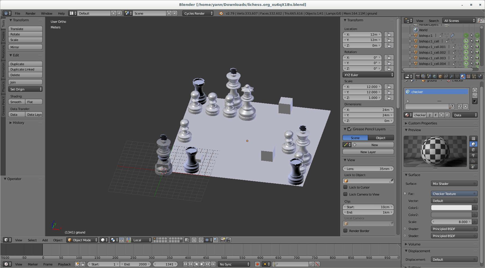
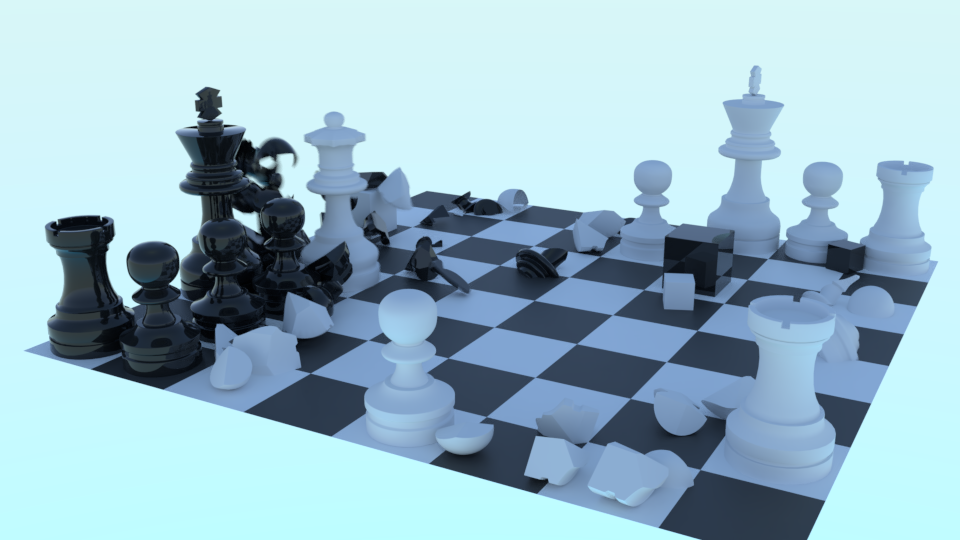

# Teasers

Original game URL: https://lichess.org/XqFNCoJP/black#91

Generated scene:

Render with some materials:

# What is this?

A Blender script + website to generate Blender files from chess PGN from Lichess

# Compatibility

* Only Lichess at the moment
* Python script tested on Blender 2.79b
* Ansible setup for CentOS 7

# Code

If you are only looking for the Blender script, see here: [blender script](blender/chess_fracture.py)

To test by yourself, see the website **TODO**, or setup an instance yourself [ansible setup](ansible)

# Libraries

Made with
* [python-chess](https://github.com/niklasf/python-chess)
